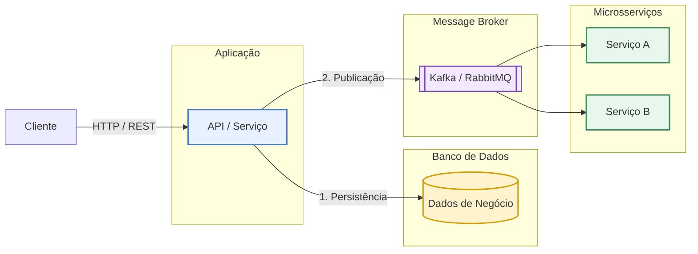
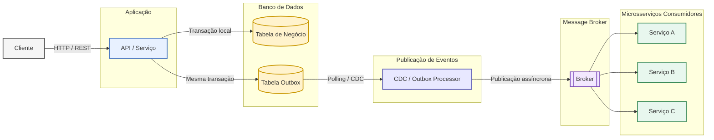
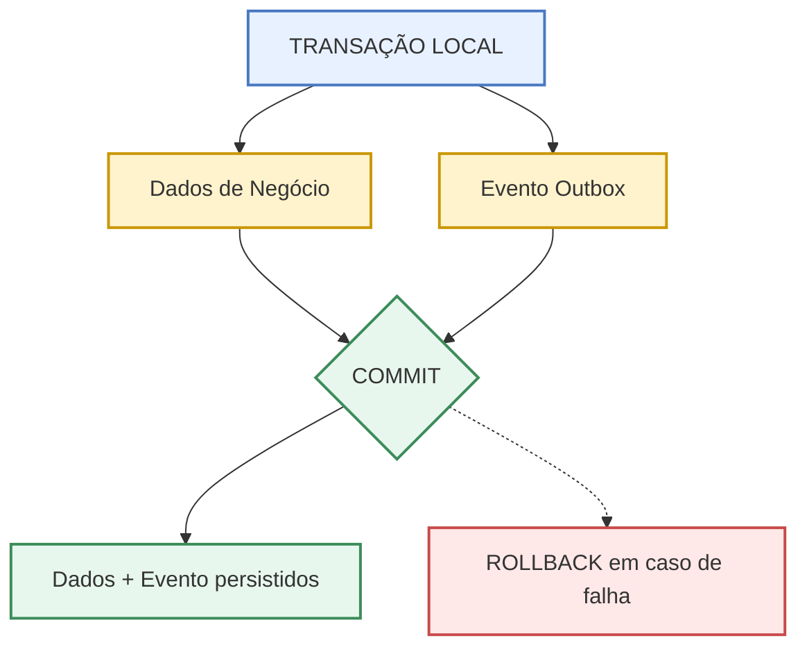
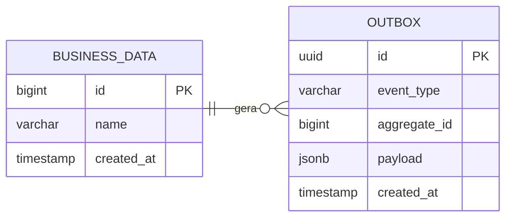
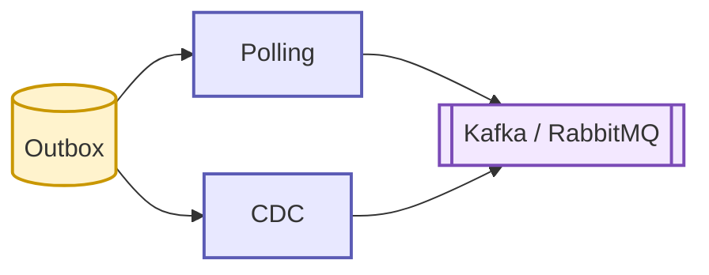
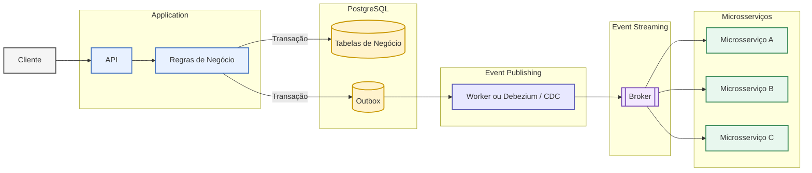
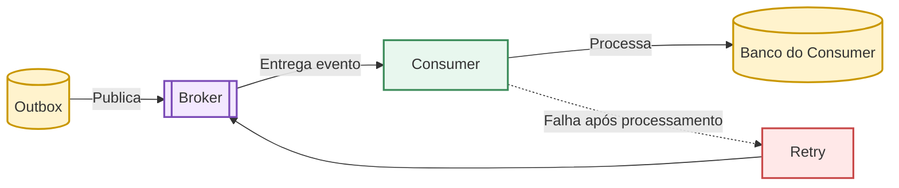
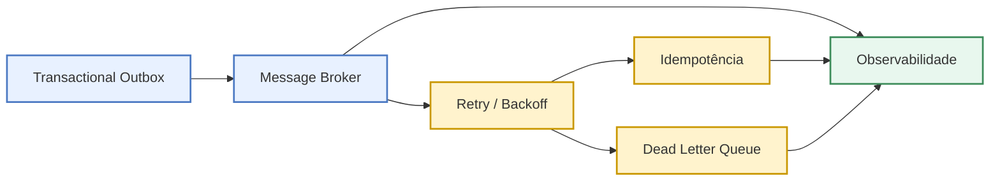

# Resolvendo o Problema de Dual Write com Transactional Outbox

Este documento apresenta o padrão arquitetural **Transactional Outbox** como uma solução para o problema de **Dual Write (dupla escrita)** em sistemas distribuídos.

O objetivo é garantir a consistência entre a persistência dos dados de negócio e a publicação de eventos em sistemas de mensageria, como **Kafka** ou **RabbitMQ**.

---

## 1. O Problema: Dual Write

O **Dual Write** acontece quando uma aplicação precisa atualizar dois sistemas diferentes como parte da mesma operação de negócio:

* Banco de dados;
* Message Broker.

Como essas operações possuem mecanismos de persistência independentes, não existe garantia de atomicidade entre elas.

### Arquitetura problemática



O problema está no fato de que a API precisa realizar **duas operações independentes**.

Se a aplicação conseguir persistir o dado, mas falhar antes de publicar o evento, teremos:

```text
Banco de Dados
      │
      └── Dados persistidos ✓

Message Broker
      │
      └── Evento não publicado ✗
```

O sistema passa a apresentar um estado inconsistente:

> **O dado existe no banco, mas os outros serviços não sabem que ele foi criado ou alterado.**

---

## 2. A Solução: Transactional Outbox

O **Transactional Outbox** introduz uma tabela `Outbox` dentro do mesmo banco de dados utilizado pela aplicação.

A aplicação deixa de realizar diretamente:

```text
API ──────► Banco
 │
 └────────► Kafka
```

E passa a utilizar:

```text
API ──────► Banco
              │
              ├── Dados de Negócio
              │
              └── Outbox
                    │
                    ▼
                  Kafka
```

O ponto fundamental é que **os dados de negócio e o evento são persistidos na mesma transação local**.

### Arquitetura com Transactional Outbox



### O que mudou?

A API agora possui apenas uma responsabilidade transacional:

> **Persistir o estado da aplicação e registrar o evento que representa essa alteração.**

A publicação no Message Broker deixa de fazer parte da operação principal.

---

## 3. Onde está a garantia de consistência?

A garantia está na transação realizada dentro do banco de dados.



O banco garante que as duas operações sejam confirmadas ou revertidas conjuntamente.

---


## 4. Estrutura da Outbox

A tabela Outbox funciona como uma área de armazenamento temporário e persistente. Ela garante que os eventos sejam publicados sem impactar a performance da requisição inicial.

O diagrama abaixo mostra a relação horizontal entre os dados do negócio e a tabela de eventos:


### Exemplo Prático de Preenchimento

Quando um novo usuário é cadastrado, o banco de dados grava duas linhas simultaneamente na mesma transação (ACID):

#### 1. Registro na tabela BUSINESS_DATA

```json
{
  "id": 456,
  "name": "João Silva",
  "created_at": "2026-08-28T16:00:00Z"
}
```

#### 2. Registro na tabela OUTBOX (O Evento)

```json
{
  "id": "8b7f3c20-7b8f-4f91-a1d7-123456789abc",
  "event_type": "UserCreated",
  "aggregate_id": 456,
  "status": "PENDING", // Necessário se a estratégia de leitura for Worker / Polling
  "payload": {
    "userId": 456,
    "name": "João Silva",
    "email": "joao@email.com"
  },
  "created_at": "2026-08-28T16:00:01Z"
}
```

A aplicação salva ambos os registros no banco de dados local e libera a resposta para o cliente. Não há espera pela resposta do Kafka ou RabbitMQ. O evento está seguro e pronto para ser processado em segundo plano.

---

## 5. Publicação Assíncrona

Depois que o evento é persistido, um componente separado fica responsável por encaminhá-lo ao Message Broker.

Existem duas estratégias principais:



### Polling

Um worker consulta periodicamente a Outbox e identifica eventos que precisam ser publicados.

### CDC

Com **Change Data Capture**, ferramentas como **Debezium** podem capturar as alterações realizadas na tabela Outbox e encaminhar os eventos para o sistema de mensageria.

---

## 6. Arquitetura Completa

Considerando o fluxo completo, temos:



---

## 7. Principais Vantagens

### Atomicidade

O dado de negócio e o evento são persistidos na mesma transação local.

### Resiliência

Se o Message Broker estiver indisponível, o evento permanece armazenado na Outbox e pode ser publicado posteriormente.

### Desacoplamento

A aplicação não depende da disponibilidade do broker para concluir a operação de negócio.

### Consistência Eventual

Os consumidores recebem os eventos de forma assíncrona, permitindo que diferentes serviços atualizem seus estados posteriormente.

### Rastreabilidade

Os eventos persistidos na Outbox podem ser utilizados para monitoramento, diagnóstico e auditoria.

---

## 8. Uma Limitação Importante

O **Transactional Outbox não garante exatamente uma entrega (`exactly-once`) por si só**.

Ainda pode ocorrer uma duplicação durante o processamento:



Por isso, os consumidores devem ser projetados considerando **idempotência** e estratégias de **retry**.

Uma arquitetura de mensageria robusta normalmente combina:



---

## 9. Conclusão

O **Dual Write** surge quando uma aplicação precisa persistir dados em um banco e publicar um evento em um Message Broker sem possuir uma garantia de atomicidade entre essas operações.

O **Transactional Outbox** resolve esse problema deslocando o registro do evento para dentro do banco de dados.

O princípio é:

> **Dados de negócio + Evento Outbox = uma única transação local.**

A publicação no broker acontece posteriormente, por meio de **Polling** ou **CDC**, permitindo maior resiliência e desacoplamento.

A principal ideia é:

> **A aplicação não tenta garantir atomicidade entre o banco e o broker. Ela garante atomicidade dentro do banco e deixa a publicação do evento para um processo posterior e resiliente.**

---

## Referências

* [Vídeo original: DUAL WRITE | O PROBLEMA QUE MAIS REPROVA PROGRAMADORES](https://www.youtube.com/watch?v=s5RzLh8H5B0)

* [Padrão Transactional Outbox (Microservices.io)](https://microservices.io/patterns/data/transactional-outbox.html)

